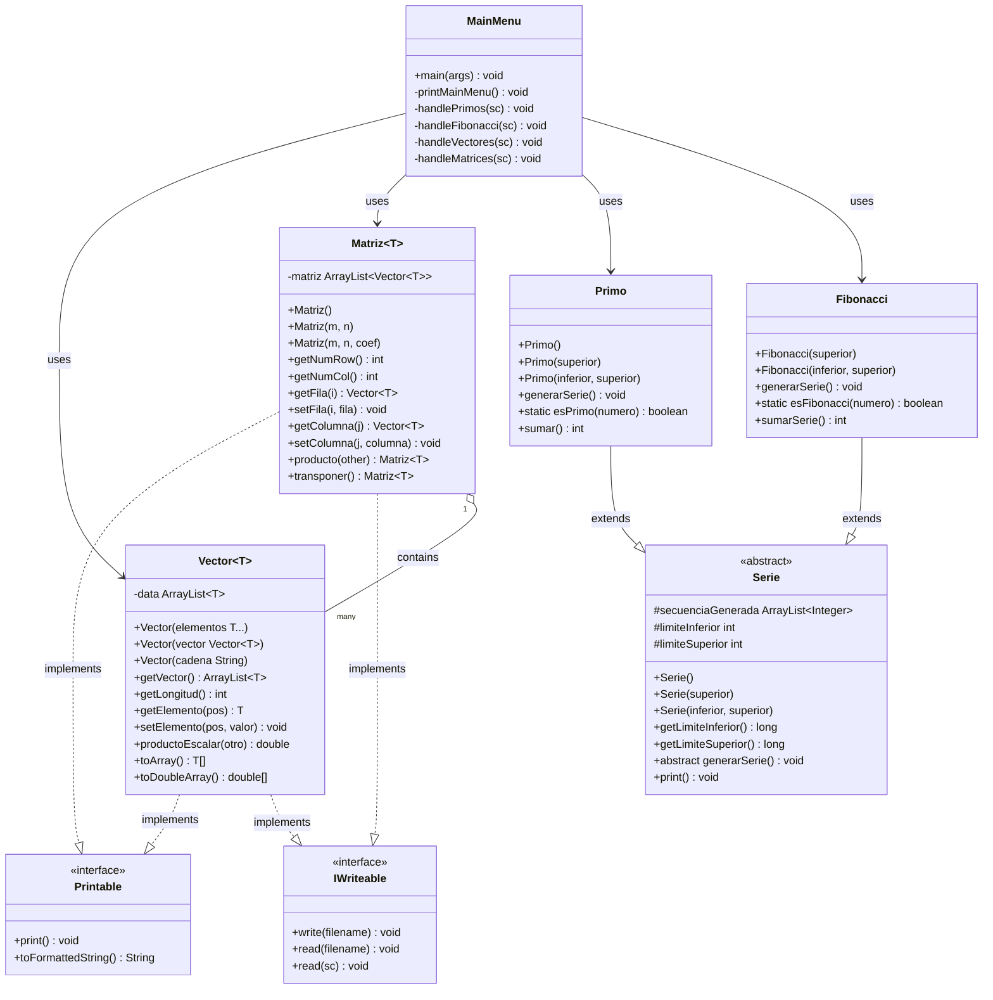

# Práctica 1: Programación Orientada a Objetos en Java


## 📚 Descripción

Esta práctica implementa una serie de clases que aplican los conceptos fundamentales de la programación orientada a objetos (POO) en Java. El proyecto incluye implementaciones de números primos (utilizando la Criba de Eratóstenes), la serie de Fibonacci, vectores n-dimensionales y matrices.

## 🏗️ Estructura del Proyecto

El proyecto está organizado en los siguientes paquetes:

```
src/
├── ejercicio1/
│   ├── app/
│   │   └── MainMenu.java             # Menú principal y punto de entrada
│   ├── arreglos/
│   │   ├── IWriteable.java           # Interfaz para operaciones I/O
│   │   ├── Printable.java            # Interfaz para operaciones de impresión
│   │   ├── Vector.java               # Clase Vector n-dimensional
│   │   └── Matriz.java               # Clase Matriz mxn
│   └── series/
│       ├── Serie.java                # Clase abstracta para series numéricas
│       ├── Primo.java                # Implementación de números primos
│       └── Fibonacci.java            # Implementación de serie de Fibonacci
└── Test/
    ├── FibonacciTest.java            # Tests para la clase Fibonacci
    ├── MatrizTest.java               # Tests para la clase Matriz
    ├── PrimoTest.java                # Tests para la clase Primo
    └── VectorTest.java               # Tests para la clase Vector
```

## 🔍 Funcionalidades Principales

### Series Numéricas

- **Números Primos**: Generación de números primos en un rango utilizando la Criba de Eratóstenes.
- **Serie de Fibonacci**: Generación de los n primeros números de Fibonacci, o aquellos comprendidos en un intervalo.

### Estructuras de Datos

- **Vectores**: Representación de vectores n-dimensionales con operaciones como producto escalar.
- **Matrices**: Matrices bidimensionales con operaciones como multiplicación de matrices y transposición.

### Entrada/Salida

- Almacenamiento y recuperación de vectores y matrices en/desde archivos de texto.
- Formato de archivo simple basado en la estructura de los datos.

## 📋 Diagrama de Clases

El proyecto está estructurado siguiendo una arquitectura orientada a objetos con interfaces, clases abstractas y herencia:



## 🚀 Uso

El programa principal está en la clase `MainMenu`, que ofrece un menú interactivo con las siguientes opciones:

1. **Números Primos**
    - Generar y mostrar números primos en un rango
    - Calcular la suma de los números primos generados

2. **Serie Fibonacci**
    - Generar y mostrar los n primeros elementos
    - Comprobar si un número pertenece a la serie

3. **Operaciones con Vectores**
    - Crear y mostrar vectores
    - Calcular el producto escalar
    - Guardar y cargar vectores desde ficheros

4. **Operaciones con Matrices**
    - Crear y mostrar matrices
    - Calcular el producto de matrices
    - Guardar y cargar matrices desde ficheros

### Ejemplo de Ejecución

Para ejecutar el programa:

```bash
java -cp bin ejercicio1.app.MainMenu
```

## 🧪 Tests Unitarios

El proyecto incluye tests unitarios exhaustivos para todas las clases implementadas, usando JUnit. Para ejecutar los tests:

```bash
java -cp bin:lib/junit.jar org.junit.runner.JUnitCore Test.PrimoTest Test.FibonacciTest Test.VectorTest Test.MatrizTest
```

## 💡 Características Destacadas

- **Genéricos**: Uso de genéricos para mayor flexibilidad en vectores y matrices.
- **Interfaces**: Definición clara de comportamientos a través de interfaces.
- **Herencia**: Jerarquía de clases bien estructurada.
- **Encapsulamiento**: Protección adecuada de datos internos.
- **Polimorfismo**: A través de la abstracción de la clase Serie.
- **Programación Funcional**: Uso de streams y expresiones lambda para operaciones con colecciones.

## 📝 Notas sobre la Implementación

### Clase Vector
- Implementa operaciones esenciales para vectores n-dimensionales.
- El método `productoEscalar` calcula el producto escalar con otro vector.

### Clase Matriz
- Implementa una matriz como una colección de vectores (filas).
- El método `producto` utiliza el producto escalar de vectores para multiplicar matrices.
- El método `transponer` intercambia filas por columnas usando los métodos `getColumna` y `setFila`.

### Criba de Eratóstenes
- Algoritmo eficiente para encontrar todos los números primos hasta un límite determinado.
- Implementado en la clase `Primo`.

### Serie de Fibonacci
- Implementa tanto la generación progresiva como la verificación matemática de pertenencia.
- Método `esFibonacci` determina si un número pertenece a la serie sin generar toda la secuencia.

## 👨‍💻 Autor

Desarrollado por Daniel Alejandro Álvarez Casablanca

## 📜 Licencia

Este proyecto está disponible bajo la licencia MIT.